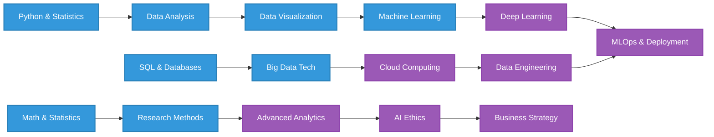

  # Hello, I'm Inder 👋
  
  
  
  
Transforming data into actionable insights and intelligent solutions

  
  
  
  
  
  

## 👨‍💻 About Me

I'm a data enthusiast on a journey to become a skilled Data Scientist, passionate about:

- 📊 Extracting meaningful insights from complex datasets
- 🤖 Building machine learning models that solve real-world problems
- 📈 Creating compelling data visualizations that tell a story
- 🧠 Continuously expanding my knowledge in AI and data science

With a strong analytical mindset and technical skills, I aim to contribute to data-driven decision making and innovation.

### 🌱 What I'm Learning
- **Python** for data analysis and machine learning
- **SQL** for database management and querying
- **Power BI** for data visualization and business intelligence
- **Machine Learning** algorithms and frameworks

---

## 🔥 My Tech Stack

<table>
  <tr>
    <td align="center" width="96">
      
       Python
    </td>
    <td align="center" width="96">
      
       MySQL
    </td>
    <td align="center" width="96">
      
       Power BI
    </td>
     <td align="center" width="96">
      
       Tableau
    </td>
    <td align="center" width="96">
      
       Scikit-Learn
    </td>
    <td align="center" width="96">
      
       Pandas
    </td>
    <td align="center" width="96">
      
       TensorFlow
    </td>
  </tr>
  <tr>
    <td align="center" width="96">
      
       NumPy
    </td>
    <td align="center" width="96">
      
       Jupyter
    </td>
    <td align="center" width="96">
      
       Git
    </td>
    <td align="center" width="96">
      
       Matplotlib
    </td>
    <td align="center" width="96">
      
       Seaborn
    </td>
    <td align="center" width="96">
      
       Plotly
    </td>
  </tr>
</table>

  <h2>🌟 Data Science Journey</h2>

 
  

  <h2>📫 Let's Connect</h2>
  

    <em>Open to collaborations, discussions, and new opportunities</em>
  

  
  
 

  

