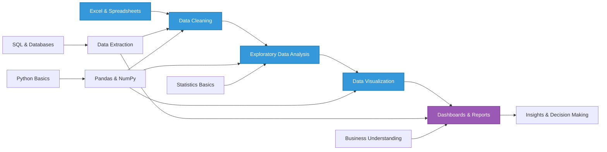

# Hello, I'm Inder 👋
  

Transforming data into actionable insights and intelligent solutions

  

  

👨‍💻 About Me

I'm a data enthusiast on a journey to become a skilled Data Analyst, passionate about transforming raw data into meaningful insights that support better decision-making.

📊 Analyzing and interpreting complex datasets

📈 Creating clear and impactful data visualizations

🧠 Continuously improving my analytical and problem-solving skills

🤖 Using AI tools to enhance productivity and data analysis

Currently, I’m learning Python through Dr. Angela Yu’s course and strengthening my data analytics foundation with 365 Data Science. My focus is on data cleaning, exploratory data analysis, and storytelling through dashboards and reports.

With a strong analytical mindset and growing technical skills, I aim to contribute to data-driven decisions and business insights in the modern, AI-assisted analytics era.

🌱 What I’m Learning

Python for data analysis and automation

SQL for data extraction and querying

Power BI for dashboards and business reporting

Statistics for data interpretation and insights

## 🔥 My Tech Stack

<table>
  <tr>
    <td align="center" width="96">
      
       Excel
    </td>
    <td align="center" width="96">
      
       PostgreSQL
    </td>
    <td align="center" width="96">
      
       Python
    </td>
    <td align="center" width="96">
      
       NumPy
    </td>
    <td align="center" width="96">
      
       Pandas
    </td>
    <td align="center" width="96">
      
       Matplotlib
    </td>
    <td align="center" width="96">
      
       Seaborn
    </td>
  </tr>
  <tr>
    <td align="center" width="96">
      
       Plotly
    </td>
    <td align="center" width="96">
      
       Power BI
    </td>
    <td align="center" width="96">
      
       Tableau
    </td>
    <td align="center" width="96">
      
       Git
    <td align="center" width="96">
      
       VS Code
    </td>
    </td>
  </tr>
</table>

---

## 🌟 Data Analyst Journey

  

 

  <h2>📫 Let’s Connect</h2>
  

    <em>Open to opportunities, collaborations, and meaningful discussions</em>
  

   

  
  
  

 

  

